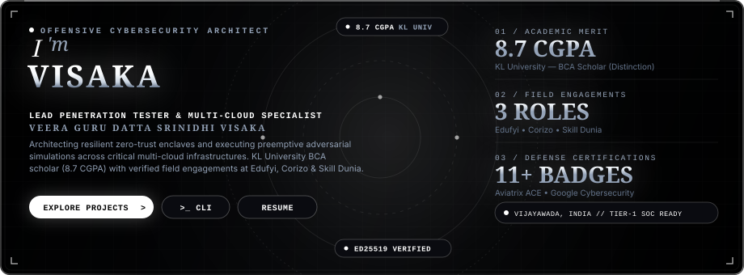
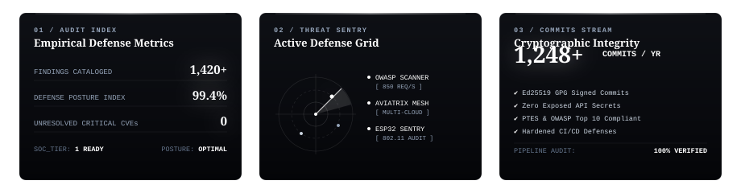

<div align="center">



<br/>

<a href="https://chinnu2523.github.io">
  
</a>

<br/>

<a href="https://chinnu2523.github.io" target="_blank">
  
</a>
&nbsp;
<a href="https://linkedin.com/in/visaka-srinidhi-a445a82al" target="_blank">
  
</a>
&nbsp;
<a href="mailto:chinnu.visakas@gmail.com">
  
</a>
&nbsp;


<br/><br/>


</div>

## 🏛️ Strategic Executive Dossier

```bash
# Terminal Identity Verification
$ whoami --profile
Veera Guru Datta Srinidhi Visaka [Lead Penetration Tester & Multi-Cloud Architect]
Status: Tier-1 SOC Ready // Open for Strategic Security Roles & High-Impact Engagements
```

Detail-oriented **Cybersecurity Specialist and Multi-Cloud Security Associate** pursuing Bachelor of Computer Applications (BCA) at **KL University with an 8.7 CGPA Distinction**. 

Armed with field-tested internship experience across **Edufyi Tech Solutions**, **Corizo**, and **Skill Dunia**, backed by industry certifications from **Aviatrix (ACE)**, **Google**, and **ISC2**. Dedicated to discovering critical attack vectors before adversaries do and building hardened, zero-trust cloud perimeters.

<br/>

<table align="center" width="100%">
  <tr>
    <td width="50%" valign="top">
      <h4>🎯 Core Mission & Directives</h4>
      <ul>
        <li><b>Offensive Security:</b> Manual and automated penetration testing, vulnerability discovery, and exploit analysis.</li>
        <li><b>Cloud Architecture:</b> Hardening multi-cloud perimeters across AWS, Microsoft Azure, GCP, and Aviatrix Transit networks.</li>
        <li><b>Threat Intelligence:</b> Real-time packet telemetry analysis, attack surface reduction, and PTES/OWASP mapping.</li>
      </ul>
    </td>
    <td width="50%" valign="top">
      <h4>📊 Key Accolades & Telemetry</h4>
      <ul>
        <li>🎓 <b>Academic Merit:</b> 8.7 CGPA (KL University Distinction)</li>
        <li>🛡️ <b>Field Roles:</b> 3 Security Engagements (Edufyi, Corizo, Skill Dunia)</li>
        <li>📜 <b>Verified Credentials:</b> 11+ Industry Badges & Simulations</li>
        <li>🔍 <b>Vulnerability Suite:</b> Engineered OWASP Top 10 Automated Scanner</li>
        <li>📍 <b>Command Base:</b> Vijayawada, Andhra Pradesh, India</li>
      </ul>
    </td>
  </tr>
</table>

<div align="center">
  
</div>

## 🛡️ Security Defense & Technical Arsenal

### ⚔️ Offensive Security & Penetration Testing
<p>
  
  
  
  
  
  
  
</p>

### ☁️ Multi-Cloud & Enterprise Infrastructure
<p>
  
  
  
  
  
  
  
</p>

### 💻 Programming & Systems Engineering
<p>
  
  
  
  
  
  
</p>

<div align="center">
  
</div>

## 🚀 Strategic Engineering Projects

| Mission | Strategic Focus | Core Technologies | Architecture Details |
|---|---|---|---|
| 🕷️ **Autonomous Web App Vulnerability Scanner** | Offensive Reconnaissance | `Python` `Kali Linux` `OWASP Top 10` | Automated scanning suite engineered to detect SQL Injection, XSS, CSRF, and auth bypass flaws with structured executive PDF remediation reports. |
| ⚡ **Hardware IoT Wi-Fi Intrusion Enclave** | IoT & Wireless Security | `ESP32` `Arduino IDE` `802.11 Protocols` | Microcontroller security sentinel designed to audit local 802.11 frames, identify deauth attack vectors, and capture unauthenticated beacon frames. |
| ☁️ **Zero-Trust Multi-Cloud Defense Architecture** | Cloud Infrastructure | `Aviatrix ACE` `AWS VPC` `Azure VNet` `GCP` | High-availability cross-cloud transit design with centralized egress filtering, stateful firewall insertion, and end-to-end encrypted packet routes. |
| 🏢 **TATA Enterprise Cyber Defense Simulation** | Threat Emulation | `IAM` `Active Directory` `Incident Triage` | Executed end-to-end enterprise identity access management (IAM) risk mitigation, privileged escalation review, and threat incident responses via Forage. |

<div align="center">
  
</div>

## 📜 Accredited Credentials Vault

| Credential | Issuer | Classification | Distinction |
|---|---|---|---|
| ☁️ **Aviatrix Certified Multicloud Network Associate (ACE)** | Aviatrix Systems | Multi-Cloud Networking & Security | Verified Associate |
| 🛡️ **Google Professional Cybersecurity Specialization** | Google / Coursera | Threat Detection & SIEM Defense | Professional Series |
| 🔐 **Certified in Cybersecurity (CC Domain 1: Principles)** | ISC2 | Security Governance & Access Control | Verified Score |
| ⚔️ **Certified Ethical Hacker Foundations** | Red Team Leaders | Offensive Exploitation & Recon | Certified Lead |
| 📊 **Enterprise Data Analytics Job Simulation** | Deloitte / Forage | Threat Telemetry & Risk Analytics | Simulation Completed |
| 🏢 **Enterprise Cybersecurity Analyst Simulation** | TATA / Forage | Incident Response & IAM Hardening | Simulation Completed |

<div align="center">
  
</div>

## 💼 Verified Field Experience

```yaml
01_Edufyi_Tech_Solutions:
  Role: "Cybersecurity Project Intern"
  Timeline: "June 2025 – August 2025"
  Focus: "Engineered automated OWASP vulnerability scanners and delivered hardening reports to engineering leads."

02_Corizo:
  Role: "Cybersecurity & Network Penetration Testing Intern"
  Timeline: "Technical Field Engagement"
  Focus: "Deep packet analysis with Wireshark, service enumeration with Nmap, and network pivot audits."

03_Skill_Dunia:
  Role: "Cybersecurity Intern"
  Timeline: "Practicum Engagement"
  Focus: "Vulnerability analysis, baseline OS hardening, and Linux CLI defense operations."
```

<div align="center">
  
</div>

## 📊 Telemetry & Performance Intelligence

<div align="center">



<br/><br/>


</div>

<br/>

<div align="center">
  
  <p align="center">
    <sub>⚜️ SOVEREIGN EXECUTIVE CYBERSECURITY ARCHITECTURE // SRINIDHI VISAKA ⚜️</sub><br/>
    <sub>Engineered with Precision & Passion • All Rights Reserved</sub>
  </p>
</div>
